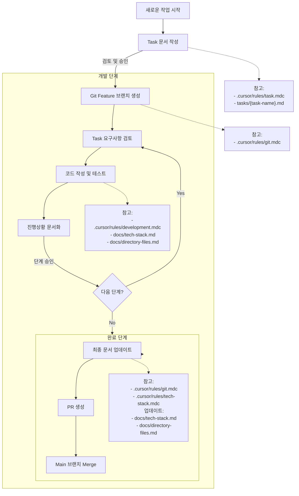
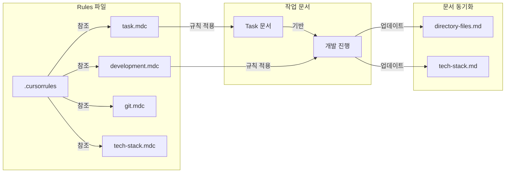

# 프로젝트 워크플로우

## 작업 Flow 다이어그램

## 문서화 규칙 다이어그램

## Rules 파일 구조

| 파일              | 위치             | 설명                          | 주요 내용                                                                                        |
| ----------------- | ---------------- | ----------------------------- | ------------------------------------------------------------------------------------------------ |
| `.cursorrules`    | 루트             | 프로젝트 전체 워크플로우 규칙 | - 작업 진행 Flow - 핵심 규칙 - 문서 동기화 규칙                                            |
| `task.mdc`        | `.cursor/rules/` | Task 문서 작성 규칙           | - 문서 생성 위치/형식 - 요구사항 작성 - 구현 분석 - 작업 계획 - 작업 진행 체크리스트 |
| `development.mdc` | `.cursor/rules/` | 개발 작업 진행 규칙           | - 선행 조건 - 개발 프로세스 - 단계 완료 조건 - 다음 단계 진행                           |
| `git.mdc`         | `.cursor/rules/` | Git 사용 규칙                 | - 브랜치 전략 - 브랜치 명명 규칙 - Commit 메시지 규칙                                      |
| `tech-stack.mdc`  | `.cursor/rules/` | 기술 스택 문서화 규칙         | - 초기 문서 작성 - 기술 스택 업데이트 - 문서화 규칙                                        |

## 작업 진행 Flow

1. 새로운 작업 시작

   - Task 문서 생성 및 작성 (`tasks/{task-name}.md`)
   - 사용자 검토 및 승인
   - 참고: `task.mdc`

2. 개발 (Development)

   - Git feature 브랜치 생성 (`feature/{task-name}`)
   - Task 문서 기반 단계별 개발
     - Task 문서 요구사항 검토
     - 코드 작성 및 테스트
     - 진행상황 문서화
   - 각 단계 사용자 승인
   - 참고: `development.mdc`

3. 완료 (Completion)
   - 최종 문서 업데이트
   - main 브랜치 merge
   - 참고: `git.mdc`

## 핵심 규칙

1. 문서 우선

   - Task 문서 승인 전 코드 작성 금지
   - 모든 변경사항 문서화 필수

2. 단계별 승인

   - 각 개발 단계는 사용자 승인 필수
   - 승인 없이 다음 단계 진행 금지

3. 문서 동기화
   - `docs/directory-files.md` 구조 정보 유지
   - `docs/tech-stack.md` 기술 스택 정보 유지
